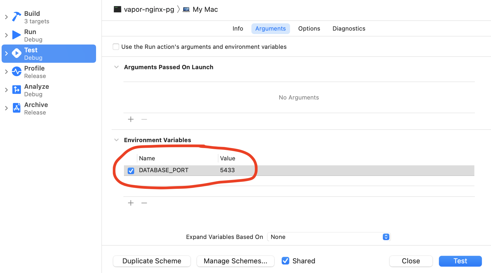

# vapor-nginx-pg

This is an example [Vapor](https://vapor.codes) app. It contains the app itself, as well as surrounding components (Postgres database, nginx frontend for providing secure connection), all runnable out of the box with `docker compose`. It is a good starting point for Vapor development of an API server which you could access from macOS and iOS clients.

The app supports several scenarios. You can run the whole thing built with docker-compose and not worry about the contents of anything. Or, you can run the Vapor app interactively from within Xcode (for development, debugging, testing) while the other components keep running in Docker. These scenarios are discussed below in greater detail.

The goal of this project is to illustrate deployment to your local macOS computer for development and testing. Although some ideas and code here may be suitable for production deployment, there are no guarantees about that, and it hasn’t been reviewed or battle-tested. Use at your own risk.

## Getting started

First, install [Docker Desktop for macOS.](https://www.docker.com/products/docker-desktop) This project may work in other environments, but I have only tested it with Docker Desktop for macOS.

You can then run the app almost out of the box. See the scenarios below.

The one thing that you do need to provide is the private key and certificate for TLS encryption (HTTPS). If you attempt to `docker compose up` right after cloning this repo, you will see errors about the certificate and key files not found. For security reasons, this project does not ship with a key and certificate: you must generate and provide your own.

### Preparing the key and certificate

See [this blog post](https://jaanus.com/ios-13-certificates/) for a discussion of TLS in modern macOS and iOS, and instructions for generating the key and certificate in a way that is acceptable to modern Apple platforms.

Create a temporary working folder. Follow the instructions in the blog post to generate your keys and certificates into that folder, and install the CA certificates into your devices. You will end up with a bunch of files, but only a few are relevant for this project.

After completing the generation process, copy `development.crt` and `development.key` into `frontend/nginx` and `frontend-xcode/nginx`, next to `nginx.conf` that is already present in those folders.

That’s it. You can now run the system with `docker compose up` (add `-d` flag to daemonize if you want).

## Common scenarios

Here are the scenarios that I have considered and tested for this project, and how to access various resources in each case.

### Developing your Vapor project in Xcode

**What:** You need to implement some business logic and functionality in Vapor. Just check out this project, and start modifying the Vapor part of the code. You can open the `backend` folder with Xcode and just run the project.

**How:** Just clone this repo, provide the key and certificate as discussed above, and run `docker compose up -d`. Then, run the project in Xcode. You can access the server with HTTPS at `https://localhost:8082` or `https://[your-mac-hostname-or-ip]:8082`. You can do this from any macOS or iOS device and it should just work, given that you have installed the development CA certificate with the above instructions. Inspect the database at the standard location `localhost:5432` with your favorite PostgreSQL client.

As an exercise, run the Vapor app in Xcode, and then run this cURL command from your Terminal:

```
curl -X POST --header "Content-type: application/json" --data '{"title": "first todo"}'  -v https://localhost:8082/todos
```

Observe the cURL output, your Docker Desktop console, Xcode console, and database content change.

### Running tests

**What:** You should write tests for your Vapor project. Run these tests with standard Xcode facilities. The tests run against a separate PostgreSQL database instance that is distinct from your application database, since the data is cleared out at each test invocation.

**How:** Use standard Xcode test running. The one thing to do is to point the tests to a different database port so that they work against the testing database instead of the real database. The easiest way to do that is to provide the environment variable via the Xcode testing scheme.



You can access the testing database directly with your favourite PostgreSQL client at `localhost:5433`.

### Using the Vapor server as-is

**What:** It may be that you are not working on the Vapor part of the code at all: you simply need to use the functionality that’s already implemented.

**How:** This couldn’t be simpler. Just clone this repo and run `docker compose up -d`. You can then access the server with HTTPS at `https://localhost:8081` or `https://[your-mac-hostname-or-ip]:8081`. You can do this from any macOS or iOS device and it should just work, given that you have installed the development CA certificate with the above instructions. Inspect the database at the standard location `localhost:5432` with your favorite PostgreSQL client.
